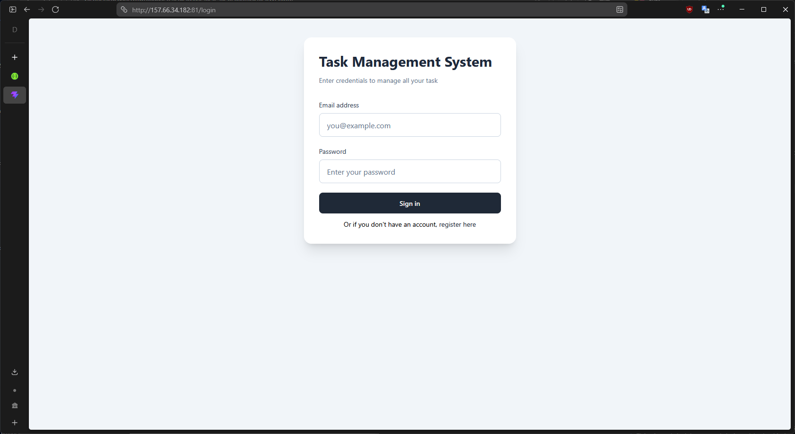
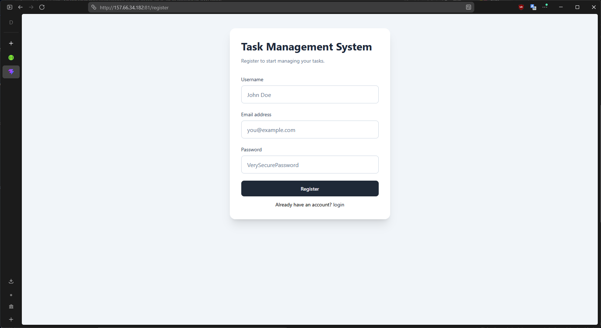
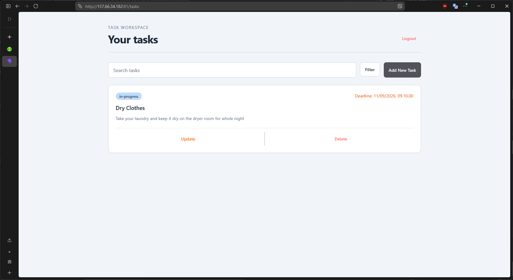
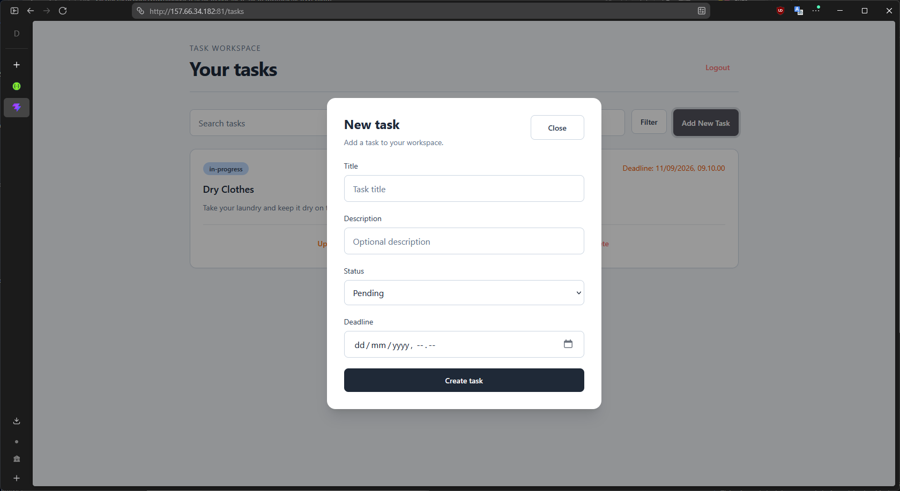
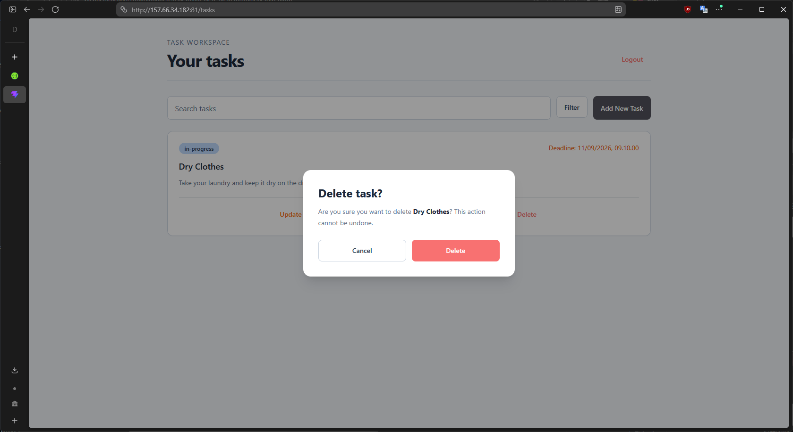

## Fullstack Web Developer Technical Test

### Description

This app is a lightweight, intuitive task management application designed to help individuals to organize daily workflows, track project milestones, and boost productivity. Built with a clean architecture and user-friendly interface.

Tech Stack
- Frontend: React / Vite, Tailwind CSS

- Backend: Node.js / Express

- Database: MySQL / MongoDB

- Authentication: JWT / OAuth 2.0

### How to Run

#### Backend
1. Setup .env files, you can use this:
```
NODE_ENV=production
NODE_PORT=3000
SWAGGER_SERVER_URL=localhost:3000

DB_HOST=157.66.34.182
DB_PORT=7831
DB_USER=root
DB_PASSWORD=31DaysAfterMidnight!
DB_NAME=tasks

JWT_SECRET=30cb187e-44f9-4fc2-9b1d-fd8206261033
JWT_DURATION=900
```
(Notes: This setup point to development DB, published/deployed website have seperate config)

2. Do `npm run dev` or if you prefer to use debugger press `F5` Launch Debugger using VSCode.

3. Apps will ready to use on port 3000.

#### Frontend
1. Setup .env files, you can use this:
```
VITE_API_URL=http://localhost:3000/api
```
Notes: Only setup for base URL API.

2. Do `npm run dev` to run development server on port 5731 and have localhost:3000/api as a backend server.

### Screenshot
1. Login
   
2. Register
   
3. Dashboard + CRUD Operations
   
   
   
   

### Live Demo
Deployed At: http://157.66.34.182:81

### API Documentations
Swagger: http://157.66.34.182:3001/docs/

(Executeable API Documentations)